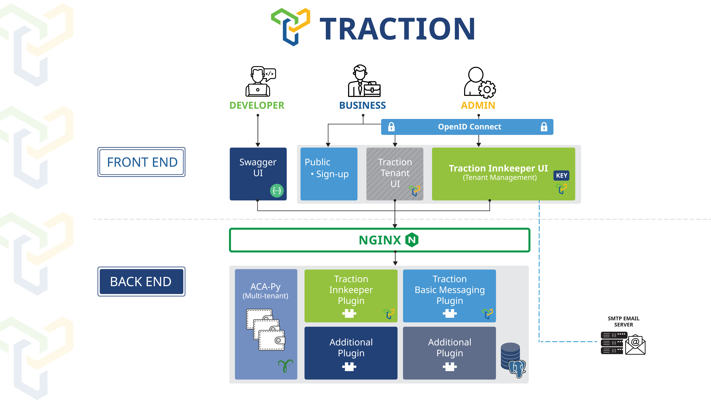
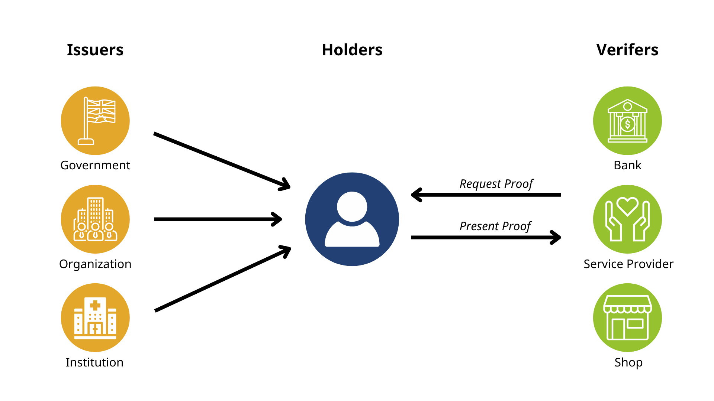
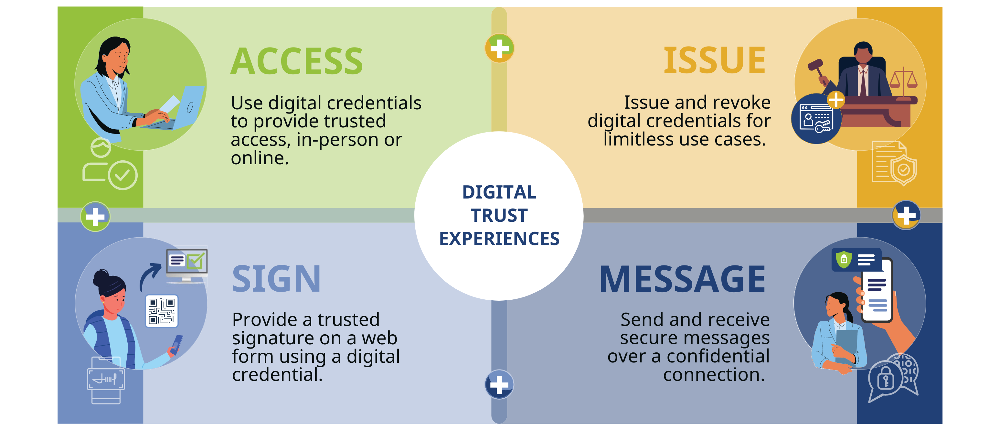

# ACA-Py Reactive MCP Server: A Decentralized Trust Layer for Agent Communications

## Overview

This project establishes a middleware communication layer between a [Traction Self-Sovereign Identity (SSI) Custodial Wallet](https://traction.xanaducyber.com) and a generative AI agent environment, using the Message-Channel-Protocol (MCP) framework. It integrates:

- A reactive client that communicates with a ChatOllama AI model  
- Multiple toolchains derived from [Traction's Swagger API](https://traction_api.xanaducyber.com)  
- Structured, multi-turn conversation flows  
- Comprehensive integration testing using a synthetic test tenant ("Alice")

The client simulates complex workflows by invoking tools in a structured fashion and summarizing outputs clearly. Tests are configured via `.example-env` and validate real-time interactions against the Traction instance.

---

## Architecture and System Design

The architecture is modular:

- **Front End:** Swagger UI, Public Portal, Business Dashboard  
- **Back End:** ACA-Py, Traction Middleware, MCP Server  
- **Reverse Proxy:** NGINX for routing and TLS termination

Agents communicate using [PeerDIDComm](https://identity.foundation/peer-did-method-spec/), supporting verifiable, encrypted messaging.

Infographics provide context on SSI components, Traction's digital infrastructure, and typical usage scenarios across justice and consumer ecosystems.

---

## Phase 1: Credential Subject-Agent Interaction with MCP

The objective is to simulate agent-driven workflows. As Alice, a test agent, the following capabilities are tested:

1. Retrieve tenancy metadata  
2. Register new credential schemas  
3. Publish credential definitions  
4. Exchange PeerDIDComm messages  
5. Poll received PeerDIDComm messages  
6. Issue verifiable credentials  
7. Accept and store credentials  
8. Request proof presentations

This phase validates that independent agents can orchestrate these functions using only MCP APIs.

---

## Phase 2: Credential Holder-to-Service Provider Interactions

We introduce Bob, a service agent listening for PeerDIDComm requests. Bob acts only when the connecting party is credentialed and authorized.

### Trust Workflow

- Bob receives a PeerDIDComm message from Alice  
- MCP verifies Alice's credentials and trust claims  
- If valid, Bob returns an appropriate message or grants resource access

---

## Core Benefits

### 1. Autonomous, Peer-to-Peer Trust Evaluation
Agents rely solely on credential-based verification, ensuring minimal central control.

### 2. Protocol-Level Interoperability
Standard schemas and DIDComm protocols foster cross-agent compatibility.

### 3. Dynamic Credential Management
Agents can issue, revoke, or expire credentials to maintain real-time trust.

### 4. Access as a Credentialized Function
Credentials can double as access tokens—ideal for rate-limited, auditable AI services.

### 5. Secure Agent Tunnels
PeerDIDComm channels validate and secure attribute disclosures in real time.

---

## Role Definitions

### Agent A (Credential Holder / Consumer)
- Represents a party (e.g., Alice) wishing to prove trustworthiness  
- Holds signed credentials issued by authoritative parties

### Agent B (Service Provider)
- Receives trust claims  
- Validates credentials before allowing access to sensitive APIs or services

---

## Conclusion

This system enables scalable, credential-driven trust frameworks between autonomous agents. Using ACA-Py, Traction, and MCP, it delivers a composable, privacy-respecting infrastructure ideal for regulated environments and AI-integrated applications.

---

## Resources

- [Traction Custodial Wallet](https://traction.xanaducyber.com)  
- [Traction API Swagger Docs](https://traction_api.xanaducyber.com)  
- [PeerDIDComm Spec](https://identity.foundation/peer-did-method-spec/)

Integration test outcomes are available under `tests/test_results`.  
To simulate Alice's perspective, refer to the `.example-env` configuration file.